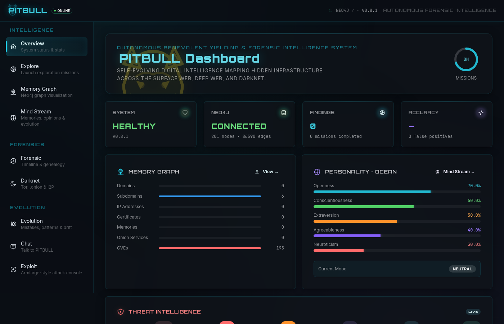
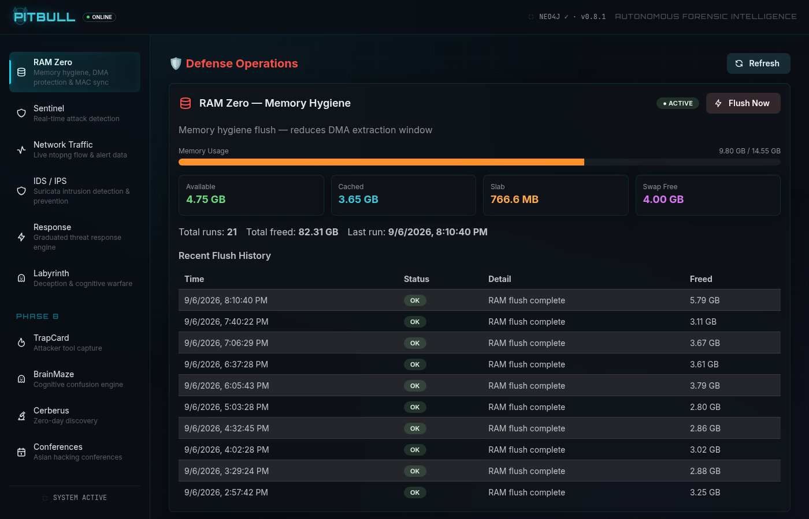

# PITBULL 🔱

## Dashboard



### RAM Zero — memory hygiene




**Autonomous Benevolent Yielding & Forensic Intelligence System**

An autonomous digital explorer with personality, reasoning, and self-evolution. It maps hidden, forgotten, and invisible corners of the internet.

## Architecture

- **Backend:** Python + FastAPI (port 8001)
- **Frontend:** React + Vite + Mantine + Cytoscape.js (code-split, lazy-loaded)
- **Memory:** Neo4j graph database
- **LLM:** Ollama (local reasoning engine)
- **Crawler:** httpx-based HTTP crawler
- **Rate Limiting:** 60 req/min per IP (in-memory, SSE/health exempt)

## Quick Start

### 1. Prerequisites

- Python 3.12+
- Node.js 20+
- Neo4j 5+ (running on localhost:7687)

### 2. Backend Setup

```bash
cd backend
python -m venv venv
source venv/bin/activate
pip install -r requirements.txt
cp .env.example .env  # edit with your Neo4j password
```

### 3. Frontend Build

```bash
cd frontend
npm install
npm run build  # produces dist/ with code-split chunks
```

### 4. Run

```bash
cd backend
source venv/bin/activate
python -m uvicorn app.main:app --host 127.0.0.1 --port 8001
```

Open `http://localhost:8001` in your browser.

### Development Mode (optional)

Run frontend dev server with hot reload:

```bash
cd frontend
npm run dev  # serves on port 5174, proxies API to 8001
```

## Features (Phases 1-8 Complete)

### Intelligence Engine
- ✅ Surface web crawler with tech detection
- ✅ DNS reconnaissance (A, AAAA, MX, NS, TXT, CNAME, SOA)
- ✅ Subdomain enumeration (crt.sh + DNS brute force)
- ✅ Certificate Transparency log collection
- ✅ Neo4j memory graph with constraints & indexes
- ✅ LLM reasoning engine (perceive → hypothesize → conclude)
- ✅ OCEAN personality system with evolution
- ✅ Episodic + semantic memory consolidation
- ✅ Curiosity engine (novelty + anomaly + gap detection)
- ✅ Mood system (7 moods with expiry and triggers)
- ✅ Pattern discovery (cross-target analysis)
- ✅ Opinion system (evidence-backed with confidence)
- ✅ Mistake learning system
- ✅ Personality drift algorithm

### Exploration
- ✅ Deep web probing (85+ paths: admin, API, .env, .git, backups, debug)
- ✅ Forensic reconstruction (timeline, infrastructure genealogy, attribution)
- ✅ Vulnerability analyzer (severity/class classification)
- ✅ WHOIS lookup
- ✅ Wayback Machine integration (external API dependent)
- ✅ Shodan integration (requires API key)
- ✅ GitHub code search (requires token)

### Darknet
- ✅ Tor controller (status, circuit management, NEWNYM)
- ✅ .onion crawling and classification
- ✅ OpSec detector for onion services
- ✅ Tor relay census (Onionoo API)
- ✅ I2P detection
- ✅ Anti-forensics suite (log wiper, timestomp, process hiding, memfd, MAC spoof, ghost mode)

### Exploit Engine
- ✅ 8 exploit modules (SQLi, XSS, SSRF, Command Injection, Path Traversal, +3)
- ✅ Auto-exploit with non-destructive PoC
- ✅ Exploit library (verified procedures)
- ✅ SSE real-time exploit event streaming

### Defense Systems
- ✅ Sentinel — real-time attack detection (36 attack types)
- ✅ Sentinel investigation — OSINT aggregation for attacker IPs
- ✅ Labyrinth — deception engine (MirrorGraph, recon detector, erosion, cognitive warfare)
- ✅ Sentinel→Labyrinth bridge
- ✅ Response engine — graduated threat response
- ✅ VIGIL bridge — ntopng + Suricata alert integration

### Phase 8 — Advanced
- ✅ TrapCard — attacker tool capture (SSH + web honeypots)
- ✅ BrainMaze — cognitive confusion engine
- ✅ Cerberus — zero-day discovery (crash triage, LLM fuzzer, target analyzer, vuln library)
- ✅ Conference Watcher — Asian hacking conference monitor

### Dashboard Pages (21 pages, code-split)
Overview · Explore · Memory Graph · Mind Stream · Forensic · Darknet · Evolution · Chat · Settings · Exploit · Anti-Forensics · RAM Zero (Defense) · Sentinel · Network Traffic (ntopng) · IDS/IPS (Suricata) · Response · Labyrinth · TrapCard · BrainMaze · Cerberus · Conferences

## API

All API routes require `X-API-Key` header (except SSE and health). Rate limited at 60 req/min per IP.

| Endpoint | Method | Description |
|----------|--------|-------------|
| `/health` | GET | System health check |
| `/api/v1/explore/start` | POST | Start exploration mission |
| `/api/v1/explore/{id}` | GET | Get mission status |
| `/api/v1/explore/` | GET | List all missions |
| `/api/v1/graph/full` | GET | Full graph data |
| `/api/v1/graph/stats` | GET | Graph statistics |
| `/api/v1/personality/` | GET/PATCH | Personality state |
| `/api/v1/patterns/discover` | POST | Discover cross-target patterns |
| `/api/v1/sentinel/` | GET | Attack detection events |
| `/api/v1/exploit/` | GET | Exploit modules & attempts |
| `/api/v1/defense/ram-poison/status` | GET | RAM Poison status |
| `/api/v1/defense/ram-zero/status` | GET | RAM Zero status |
| `/api/v1/defense/mac-sync/status` | GET | MAC sync status |
| `/api/v1/defense/dma-protection/status` | GET | DMA/IOMMU protection |
| `/api/v1/sse/mission/{id}` | GET | SSE live mission stream |
| `/docs` | GET | Swagger UI |

## State Persistence

Personality state, mood, chat history, evolution history, mistakes, audit trail, and tool library persist in `/var/lib/pitbull/` — survives reboots.

## Academic Foundations

See `research/RESEARCH_DOCUMENTATION.md` for the 25 academic papers that inform PITBULL's design.

## License

MIT — see [LICENSE](LICENSE). Copyright (c) 2026 Dan Vladoiu.